## 掘金每日自动签到，自动抽奖

本项目使用`Github Action`来部署自动签到程序，无需自己购买服务器，安全可靠且方便。另外支持钉钉机器人通知，中了大奖第一时间便可知晓。

### 使用方式

1. `fork`本项目。

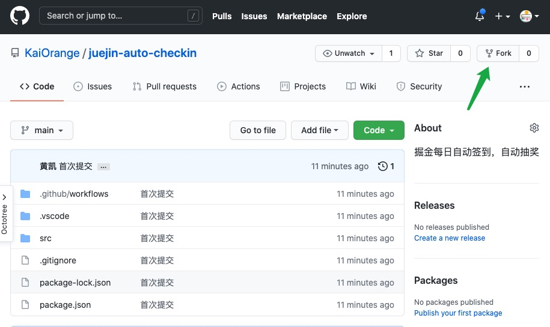

2. 依次点击【Setting】、【Secrets】、【New repository secret】。

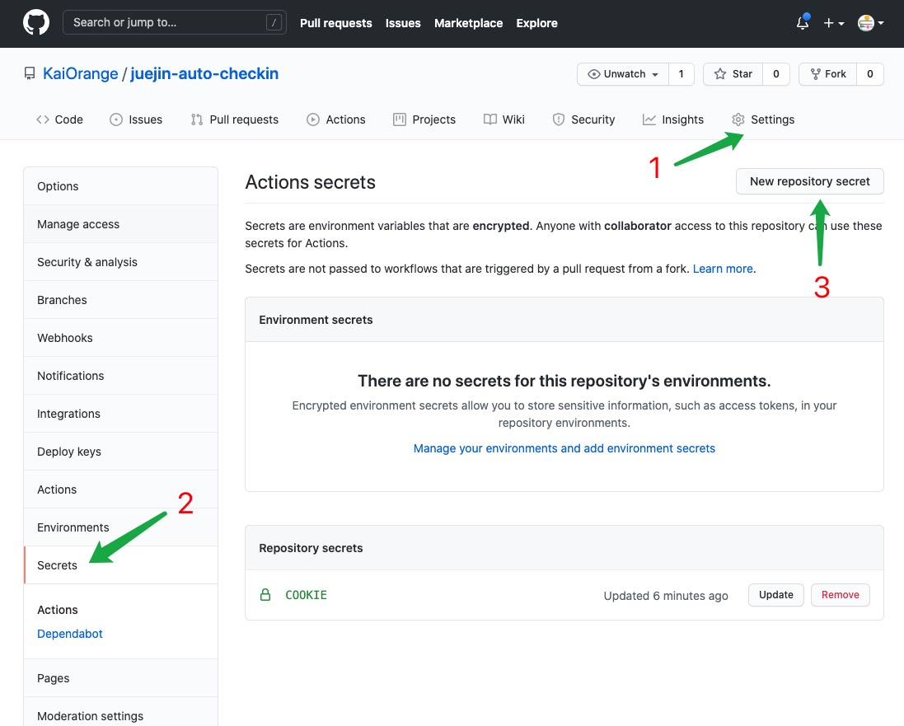

3. 把 Name 设置为`COOKIE`这个字符串，Value 设置为`自己掘金的Cookie`。

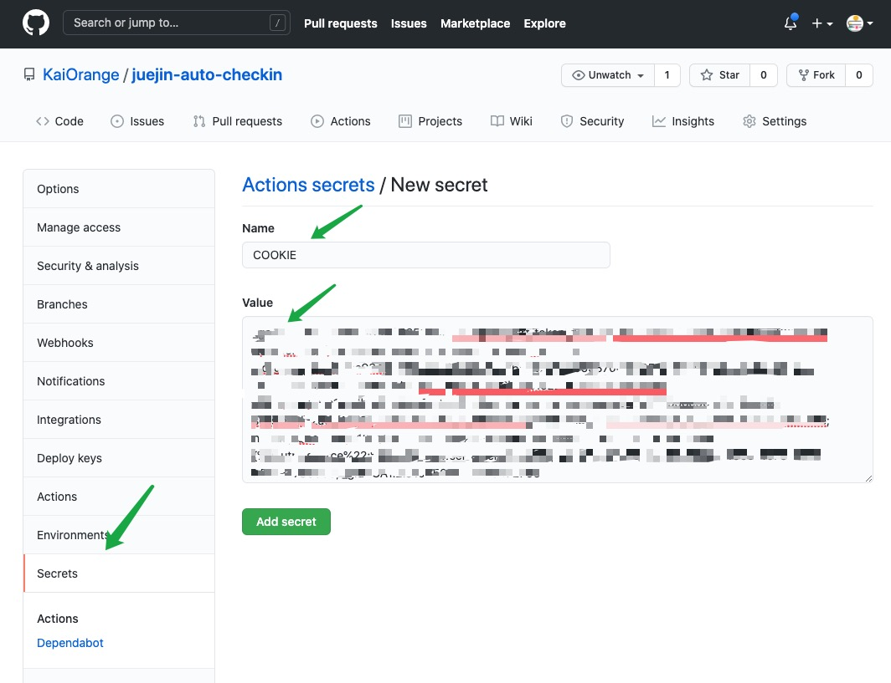

4. 掘金的 Cookie 可以在掘金打开开发者工具，然后依次点击【Network】、【Fetch/XHR】（或者【XHR】）、【任一 Name】查看是否有`cookie`字段，如果没有可以换一个接口试试，找到后复制`cookie`的值，粘贴到上面 Value 处，并点击【Add secret】。

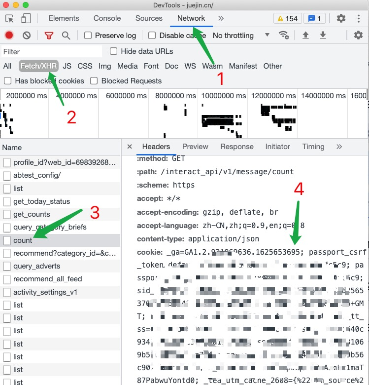

5. 允许 Github Actions 工作流。

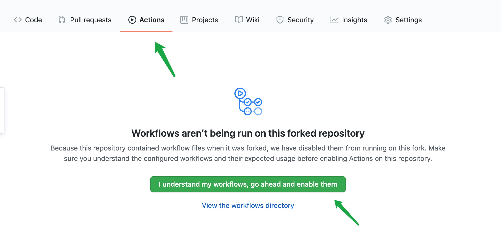

6. 第二天查看是否已经签到成功，如果中实物奖品请尽量及时填写收货地址。

### 抽奖时间修改

本程序默认是在北京时间凌晨 2 点去执行，如果需要修改签到时间，可以修改`.github/workflows/check_in.yml`文件中的`cron`字段，该字段文档可以[查看这里](https://docs.github.com/en/actions/reference/events-that-trigger-workflows)。

### 抽奖梭哈
在 Github 的 Secrets 中在添加一个变量，Name 是`ALL_IN`，Value 是 `true`。
### 接入钉钉机器人

抽奖结果可以在`掘金`和`Github Action`上查看，但是有的时候我们需要更加实时的查看中奖信息，这个时候考虑接入钉钉机器人，具体如下：

1. 创建一个打卡群。点击钉钉右上角的加号，再点击【发起群聊】，选择一个非公司的群，如【考试群】。

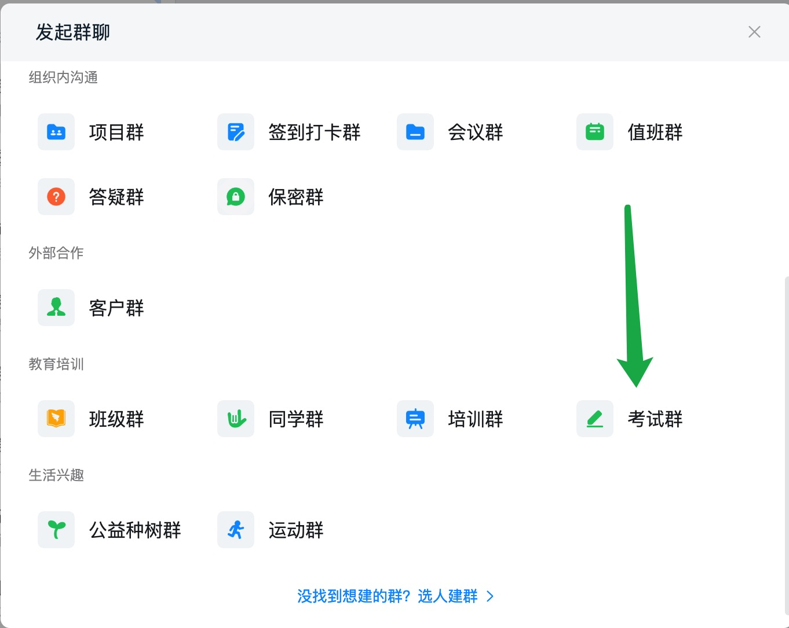

2. 输入喜欢的群名称，然后点击【创建】。

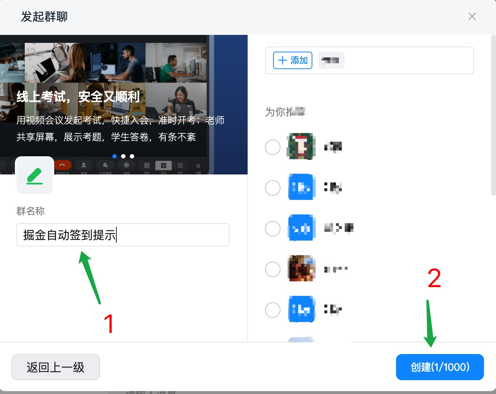

3. 在群内点击右上角设置按钮，然后依次点【智能群助手】、【添加机器人】、【自定义】、【添加】。

4. 给机器人起一个名字，然后点【加签】，并复制秘钥的内容（秘钥有点长，要复制输入框内的所有内容）。

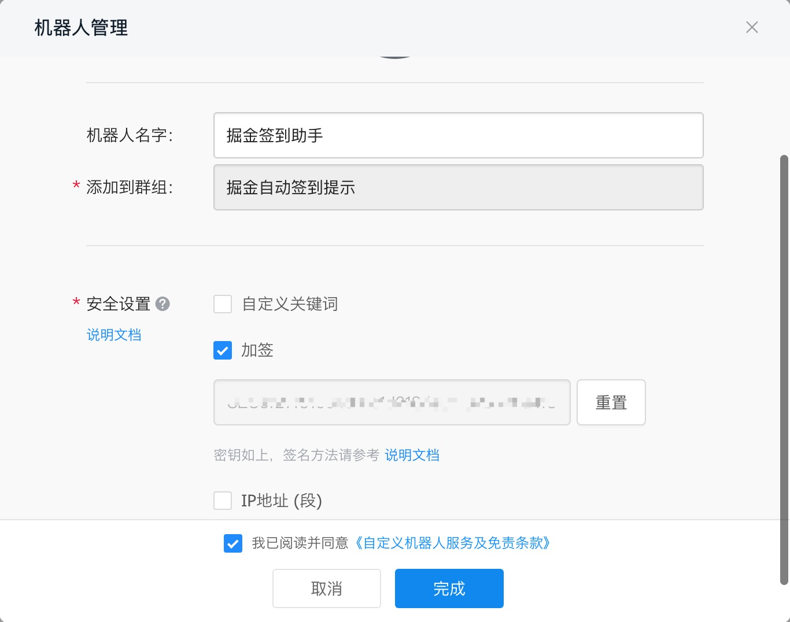

5. 在 Github 的 Secrets 中在添加一个变量，Name 是`DINGTALK_SECRET`，Value 是刚才复制的内容（操作过程可以参考上面【使用方式】第 2、3 步）。

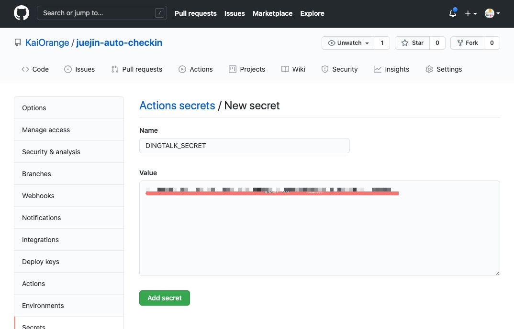

6. 完成后复制`Webhook`的内容。

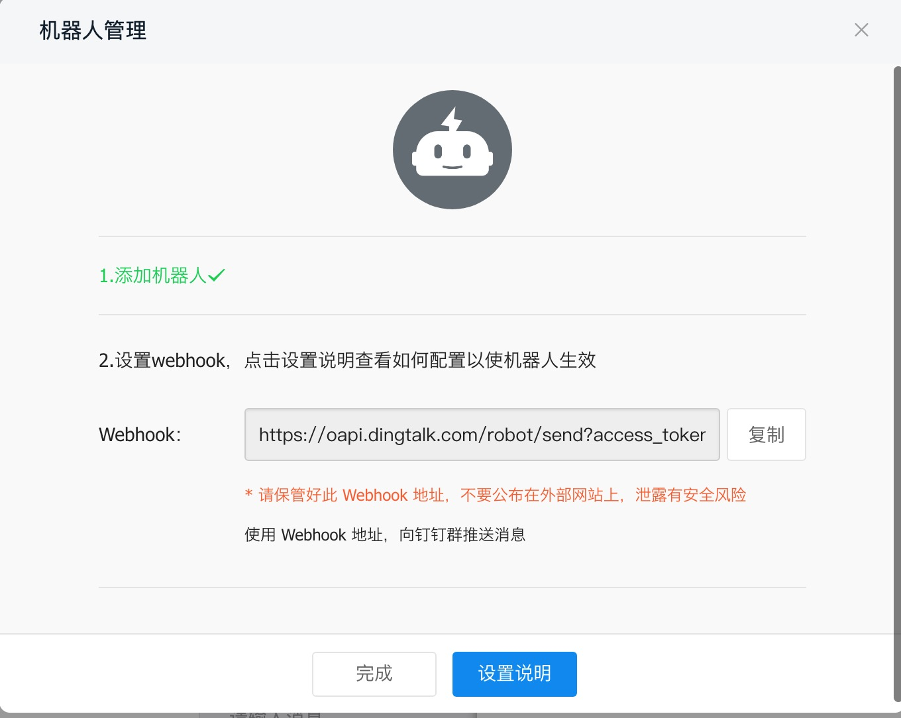

7. 在 Github 的 Secrets 中在添加一个变量，Name 是`DINGTALK_WEBHOOK`，Value 是刚才复制的内容。

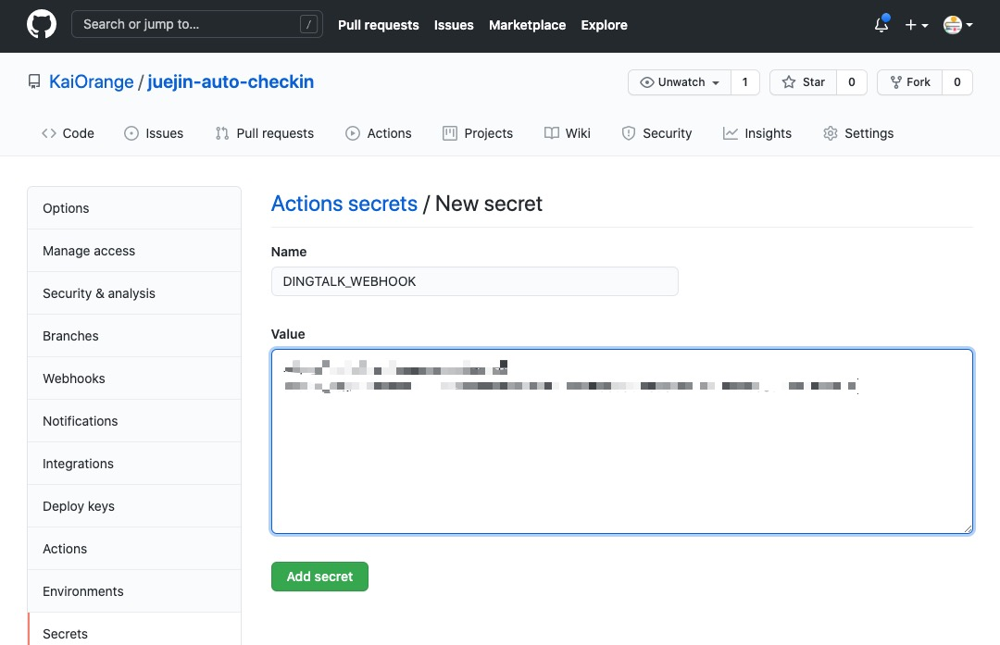

8. 返回钉钉完成即可，由于我们是凌晨签到的，如果害怕大半夜推送打扰到自己，可以把群设置成消息免打扰。

### 接入微信通知

微信通知依赖于企业微信，通过企业微信向微信推送消息

#### 第一步，注册企业

用电脑打开[企业微信官网](https://work.weixin.qq.com/)，注册一个企业。**有手机号就可以注册，不用营业执照！不用营业执照！不用营业执照！**

#### 第二步，创建应用

注册成功后，点「管理企业」进入管理界面，选择「应用管理」 → 「自建」 →  「创建应用」

应用名称随意填，可见范围选择公司名。

创建完成后进入应用详情页，可以得到应用ID( `agentid` )①，应用Secret( `secret` )②。

#### 第三步，获取企业ID

进入「[我的企业](https://work.weixin.qq.com/wework_admin/frame#profile)」页面，拉到最下边，可以得到企业ID③。

#### 第四步，推送消息到微信

进入「我的企业」 → 「[微信插件](https://work.weixin.qq.com/wework_admin/frame#profile/wxPlugin)」，拉到下边扫描二维码，关注以后即可收到推送的消息。

PS：如果出现`接口请求正常，企业微信接受消息正常，个人微信无法收到消息`的情况：

1. 进入「我的企业」 → 「[微信插件](https://work.weixin.qq.com/wework_admin/frame#profile/wxPlugin)」，拉到最下方，勾选 “允许成员在微信插件中接收和回复聊天消息”

2. 在企业微信客户端 「我」 → 「设置」  → 「新消息通知」中关闭 “仅在企业微信中接受消息” 限制条件

#### 第五步，在 github setting 添加变量

在 Github 的 Secrets 中在添加三个变量：

1. Name 是`WX_APP_ID`，Value 是第二步的 AgentId。

2. Name 是`WX_APP_SECRET`，Value 是第二步 Secret。

3. Name 是`WX_COMPANY_ID`，Value 是第三步的 企业ID。

### 接入飞书机器人

飞书机器人通知依赖于飞书，通过飞书向指定群组推送消息，具体操作如下:

1. 打开飞书，聊天列表顶部加号`创建群组`,群名称任意，点击创建
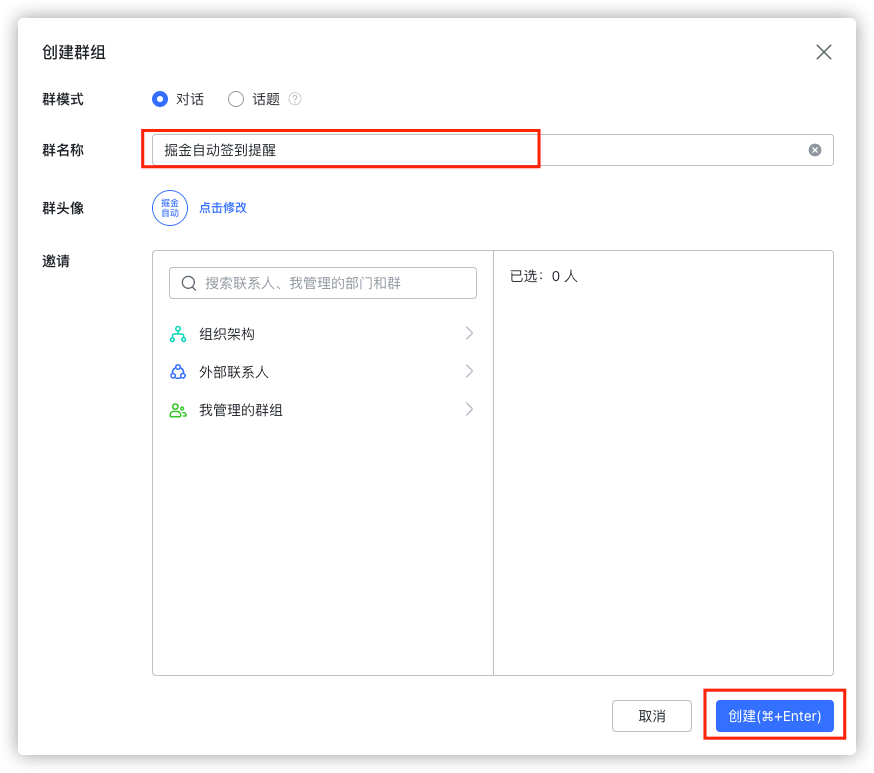

2. 进入群组，点击群组设置按钮添加机器人
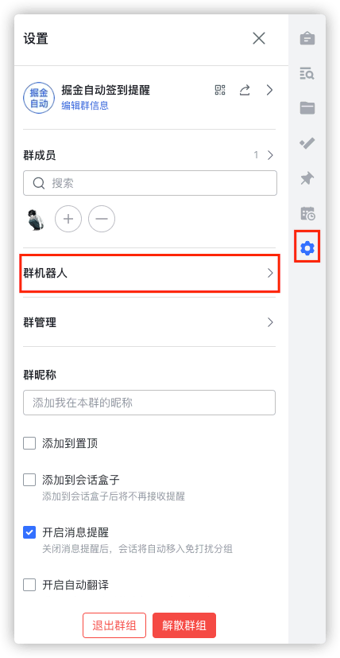

3. 选择自定义机器人
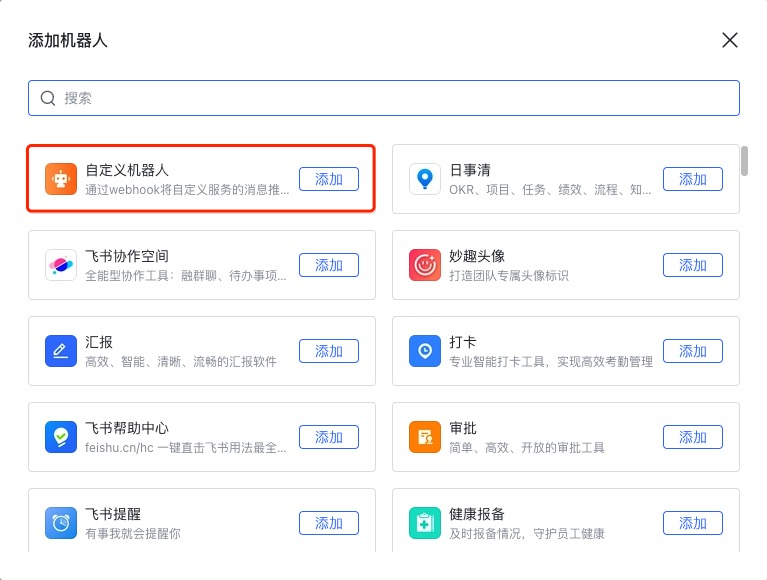

4. 机器人名称和描述随意填写,点击下一步
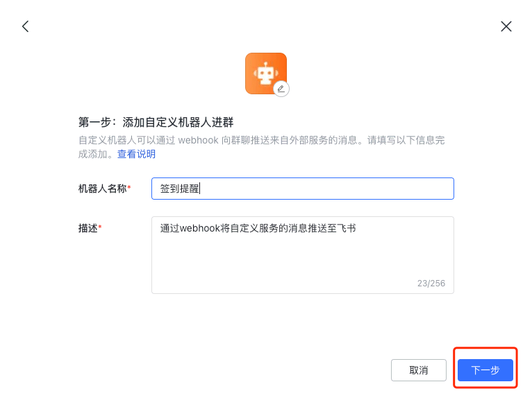

5. 在`安全设置`中勾选`签名校验`,复制下webhook地址和签名校验内容，在 Github 的 Secrets 中在添加2个变量，Name 是`FEISHU_WEBHOOK`，Value 填写 webhook地址,Name 是`FEISHU_SECRET`，Value 填写的签名校验内容
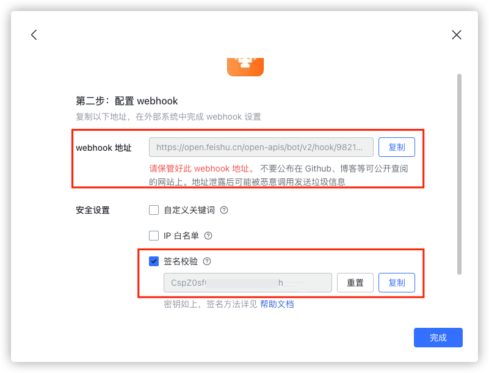
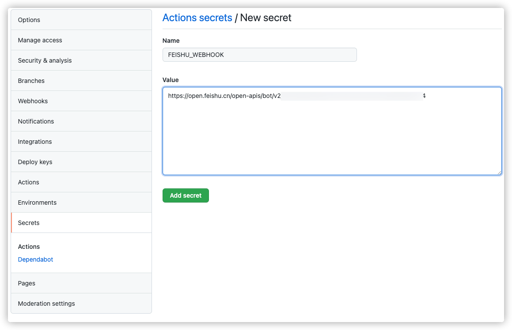
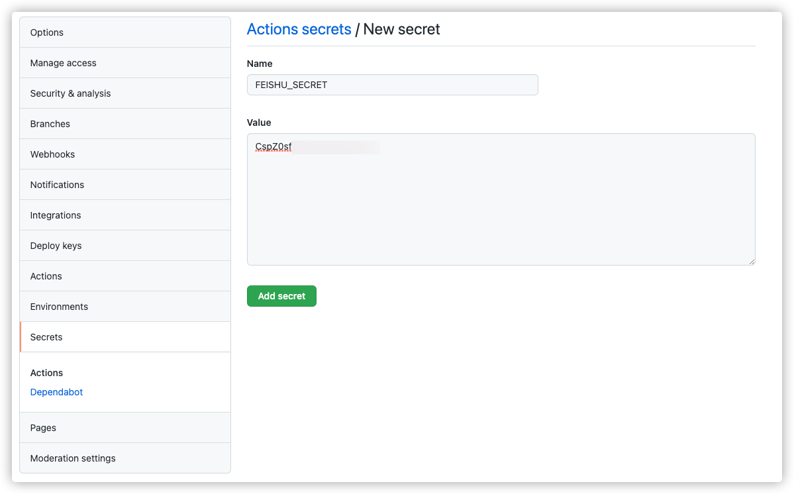
